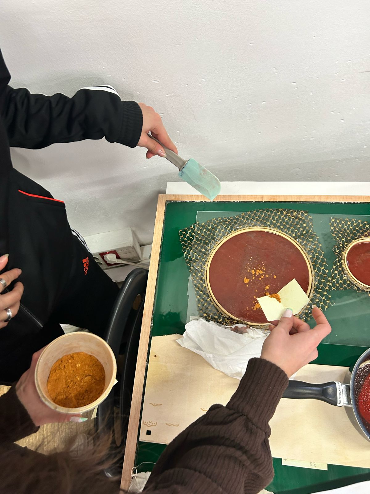
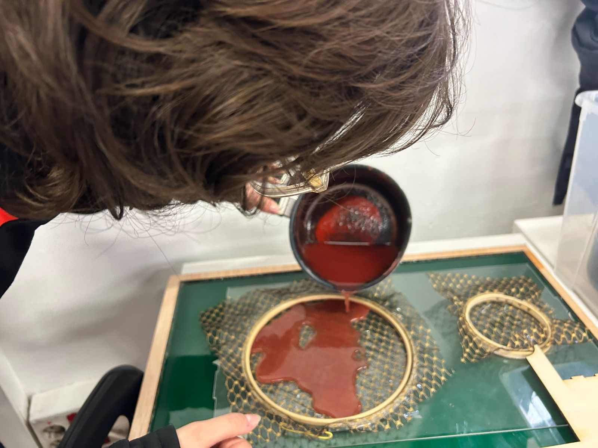
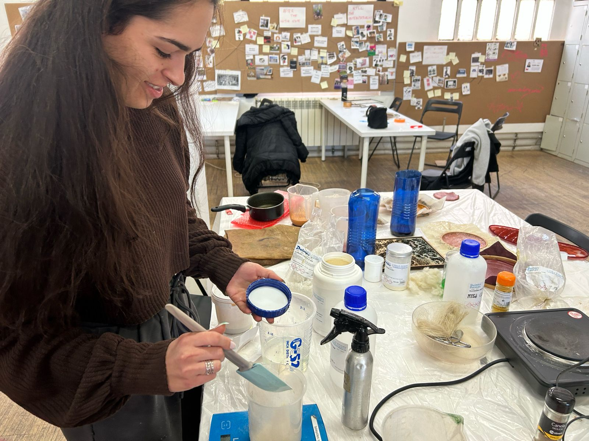
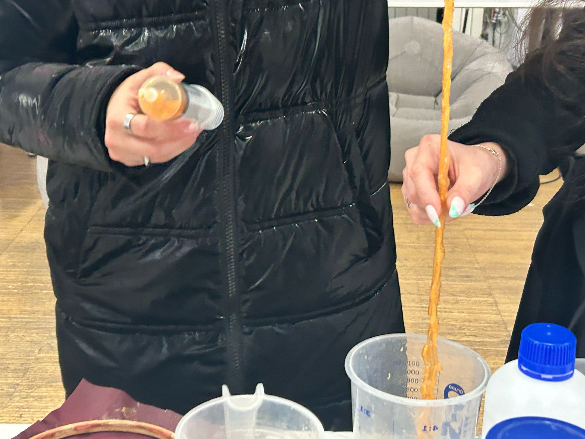

# Documentation challenge Repository - Create a biomaterial and use the laser cut
Initial testing of recipes
1. Recipes used and biomaterials

Useful link 
[MDEF website](https://mdef.fablabbcn.org/2023-24/year-1/t2/digital-prototyping-for-design/)
